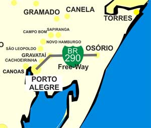

# Get Traffic Freeway BR-290 (Freeway)
This repository contains a project that get traffic information of the BR-290 (Freeway) highway, between Osório and Porto Alegre, localized in south of Brazil.

The BR-290 is one of the most important highways in Rio Grande do Sul, Brazil, with a length of 726 km, located in the state of Rio Grande do Sul, which departs from the center-north coast of the state in the west direction, to the municipality of Uruguaiana, on the border with Argentina.


The stretch between the beginning of the highway, next to BR-101 in the municipality of Osório to the city of Porto Alegre, is known as Freeway, operated by CONCEPA. This stretch has two tolls, one in Gravataí and another in Santo Antônio da Patrulha (this being charged only in the Litoral direction); And presents intense traffic, with four lanes between Osório and Porto Alegre in both directions, the other sections vary between single and double lane.



This project load the information of the average and total flow of vehicles per day in the Gravataí toll (Litoral/Capital), released by the operator Concepa. The information is stored in an Excel file.

## Code
To get the data, you must open the application with Visual Studio / Monodevelop or call it directly from the 'console application' of the Windows.

```
GetTrafficFreewayBR290 [path and name file] [start date] [end date]
```
Example:
```
GetTrafficFreewayBR290 C:\data\traffic.xlsx 01/01/2016 01/05/2016
```
You can using this application like class library in your application in the .Net platform.
```
Traffic traffic = new Traffic(
    @"C:\data\traffic.xlsx", 
    new DateTime(2016,01,01), 
    new DateTime(2016,05,01));
traffic.Run(new Excel());
```
